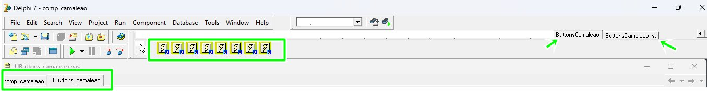

# LibStylePascal
LibStylePascal - Projeto de biblioteca gráfica em Pascal 

# Pacote visual da Lib para Delphi 7
- Componente_Camaleao;
- Pacote para instalação;
- Para instalar o pacote, abra o Projeto no Delphi, depois compile e salve.

# Pacotes instalado no Delphi 7

# Dependências: 
- TJVDotNetEdit, TJVSpeedButton, TImage.

# Modelos:

